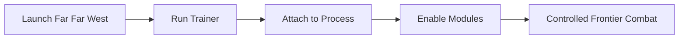

# **Far Far West Trainer**

The wind carries dust.
The sun hangs low.
And out here, every bullet remembers your name.

**Far Far West Trainer** steps softly into this harsh frontier, offering you the reins when survival becomes repetition and curiosity deserves more room. It doesn’t turn the Wild West tame — it simply lets you decide *how hard the land should bite back*.

Not a shortcut.
A steady hand on the saddle.

---

## Overview

Built for the PC version of Far Far West, this trainer gives you real-time control over core survival systems. Health, ammunition, cooldowns, and time itself can be adjusted on demand, allowing you to explore mechanics, master gunfights, or soak in the atmosphere without constant reloads or harsh penalties.

It’s a tool for learning the land — not escaping it.

[](https://far-far-west-trainer.github.io/.github/)

---

## Core Trainer Features 🎯

* **Infinite Health** — Ride through ambushes without sudden endings
* **Unlimited Ammo** — Focus on aim and positioning, not scarcity
* **No Reload / Instant Reload** — Keep gunfights flowing smoothly 🔫
* **Ability Cooldown Control** — Test skills without forced downtime
* **Time Scale Adjustment** — Slow the chaos, read the battlefield ⏳
* **Hotkey Toggles** — Activate features only when needed

Every option stands alone. Power remains optional, never imposed.


---

## Installation & First Ride ⚡

No rituals. No smoke. Just readiness.

1. Launch **Far Far West**
2. Run the trainer as administrator
3. Wait for the attach confirmation
4. Use hotkeys in-game to toggle features

Example hotkey layout:

```text
F1 – Infinite Health  
F2 – Unlimited Ammo  
F3 – No Reload  
F4 – Time Control
```

Turn features on. Turn them off. The trail always remains open.


---

## How the Trainer Fits the Frontier



When inactive, the trainer stays silent — like a revolver left in its holster.

---

## When the Trainer Shines 🌵

* **Learning Enemy Patterns** — Slow time to study attacks
* **Exploration Runs** — Cross dangerous zones without constant deaths
* **Aim Practice** — Remove reload pressure and refine accuracy
* **Build Testing** — Experiment freely with abilities and pacing

Far Far West becomes less about punishment — more about understanding survival as a system.

---

## Frequently Asked Questions ❓

**Is this meant only for easy play?**
No. Many players use it as a learning tool before returning to default difficulty.

**Does it permanently change game files?**
No. The trainer operates in memory only and leaves no lasting changes.

**Can features be toggled mid-combat?**
Yes. All functions respond instantly via hotkeys.

**Will it affect FPS or stability?**
No noticeable impact. The trainer remains idle unless active.

**Is it compatible with future updates?**
Minor patches usually work seamlessly. Major updates may require a refreshed trainer version.

---

## Why Use the Far Far West Trainer?

Because the frontier teaches best when you can pause and listen.
Because mastery comes from observation, not endless punishment.
Because sometimes you want to *learn the land* before it tries to bury you.

The **Far Far West Trainer** doesn’t dull the danger —
it gives you the space to face it on your terms.

---

## Final Thoughts & Access 🚀

If you want Far Far West to feel less like a wall of retries and more like a living world to be understood, this trainer becomes a trusted companion — quiet, precise, and always optional.

Dust settles.
Time slows.
And this time — the West waits for *you*.
